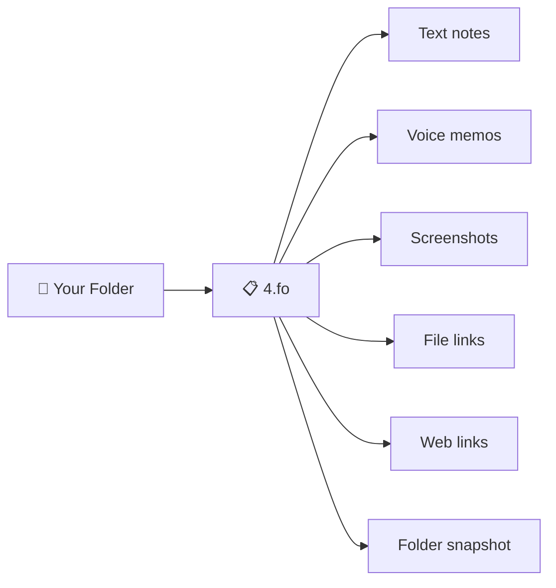

# 4Fo

**Sticking your context**

Stickers for your folders - text notes, voice memos, screenshots, links. Like messaging yourself about a folder.

🌐 Website: [kalba.dev/apps/4Fo](https://kalba.dev/apps/4Fo/)

## Problem

You have a folder. Maybe it's a project, a client, a trip, a course. Inside - files. But you open it a month later and think: What was this about? What did I decide? What's next?

The context is gone. It was in your head, in some chat, in an email you'll never find.

## Solution

4Fo adds a tiny file to your folder - like a sticky note on a box. Open it and you see a feed of your notes, voice memos, screenshots, links.

Move the folder - stickers go with it. No database. No account. No sync.


```mermaid
graph LR
    A[📁 Your Folder] --> B[📋 4.fo]
    B --> C[Text notes]
    B --> D[Voice memos]
    B --> E[Screenshots]
    B --> F[File links]
    B --> G[Web links]
    B --> H[Folder snapshot]
```

## How it works

1. Create a sticker board for any folder (Quick Action, or File → New, or just create empty `4.fo` file)
2. Add stickers - text, voice, images, links
3. Context stays with the folder - move it, copy it, back it up

```
My Project/
├── 4.fo          ← your context
├── contract.pdf
├── notes.md
└── assets/
```

## Features

- 📝 **Text notes** - "Client wants changes by Friday"
- 🎤 **Voice memos** - quick thoughts while you work
- 🖼️ **Screenshots** - references, mockups, inspiration
- 📎 **File links** - point to related files anywhere
- 🔗 **Web links** - save URLs with context
- 📋 **Folder snapshot** - list of files at this moment

## Install

1. [Download DMG](https://github.com/kalba-lab/4Fo/releases/latest)
2. Drag 4Fo.app to Applications
3. Run "Install Quick Action.app" for Finder integration (optional)

Requires macOS 15+, Apple Silicon.

**App won't open?** macOS blocks apps from developers who don't pay Apple $100/year. I don't. To open:

1. Try to open 4Fo.app (it will be blocked)
2. Go to System Settings → Privacy & Security
3. Scroll down to Security - you'll see "4Fo.app was blocked"
4. Click Open Anyway

You only need to do this once.

## Keyboard shortcuts

- `⌘N` - new board
- `⌘Enter` - save sticker
- `Esc` - cancel editing

## Tech

Swift, SwiftUI

## License

Free to use

---

📦 [Download](https://github.com/kalba-lab/4Fo/releases/latest) · ✉️ [min@kalba.dev](mailto:min@kalba.dev?subject=4Fo) · [Kalba Lab](https://kalba.dev)
